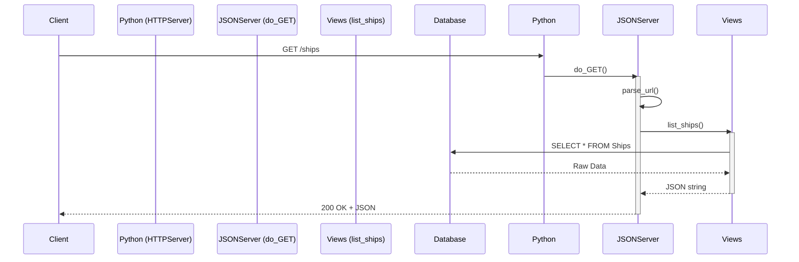

```mermaid 
sequenceDiagram
    participant Client as User (Yaak/Postman)
    participant Python as Python (HTTPServer)
    participant JSONServer as JSONServer (do_PUT)
    participant Views as Views (update_ship)
    participant Database as SQLite Database

    Note over Client, Database: Update an Existing Ship

    Client->>Python: PUT /ships/1 (with JSON data)
    Python->>JSONServer: do_PUT()
    activate JSONServer

    JSONServer->>JSONServer: parse_url()
    Note right of JSONServer: Reads the 'Request Body' JSON

    JSONServer->>Views: update_ship(pk, request_body)
    activate Views
    
    Views->>Database: UPDATE Ships SET ... WHERE id = 1
    Database-->>Views: Success/Failure
    
    Views-->>JSONServer: True (successfully_updated)
    deactivate Views

    alt is successfully_updated
        JSONServer-->>Client: 204 No Content (It worked!)
    else is False
        JSONServer-->>Client: 404 Not Found (Ship doesn't exist)
    end

    deactivate JSONServer
 ```